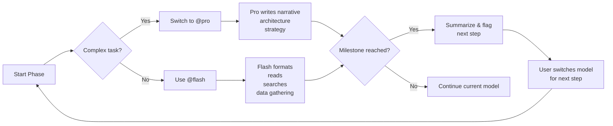

# LMM Grant Proposal — Sequential Execution Plan

> **Strategy:** Use DeepSeek V4 Flash for routine tasks (@flash) and DeepSeek V4 Pro for complex work (@pro). Switch between them at each step marker.

---

## Phase 1: Foundation (This Session ✅)

| Step | Task | Model | Status |
|------|------|-------|--------|
| 1.1 | Read idea.md + grant files | @flash | ✅ Done |
| 1.2 | Fetch all grant URLs for details | @flash | ✅ Done |
| 1.3 | Search for additional grants | @flash | ✅ Done |
| 1.4 | Create reference.md (master doc) | @flash | ✅ Done |
| 1.5 | Create .agent/SKILL.md (token-saving) | @flash | ✅ Done |
| 1.6 | Create individual grant md files | @flash | ✅ Done |
| 1.7 | Create this sequential plan | @flash | ✅ Done |

---

## Phase 2: Epic MegaGrants — Full Proposal (Priority)

| Step | Task | Model | Est. Tokens | Instructions |
|------|------|-------|------------|--------------|
| **2.1** | **Refine problem statement & narrative** | **@pro** | High | Write compelling 1-page narrative: Laos literacy crisis, why digital, why now. Make it emotionally resonant. |
| 2.2 | Add statistics and data sources | @flash | Low | Search for: Lao literacy rates, internet penetration, mobile usage stats. Format into proposal. |
| **2.3** | **Technical architecture section** | **@pro** | High | Detail UE → web → mobile pipeline. AI integration architecture. Offline download system design. |
| 2.4 | Budget table formatting | @flash | Low | Create detailed line-item budget with justifications |
| **2.5** | **Team & background section** | **@pro** | High | Write compelling team bio: US digital media company + Laos partner company. Relevant experience. |
| 2.6 | Milestone & timeline formatting | @flash | Low | Create Gantt-style timeline for 6-12 month project |
| **2.7** | **Competitive landscape & differentiation** | **@pro** | High | Analyze existing solutions, explain why our approach is unique |
| 2.8 | **Sustainability plan** | **@pro** | Medium | How project continues beyond Epic grant — subscription model, creator economy |
| 2.9 | Spell-check, formatting, final review | @flash | Low | Proofread, fix markdown, check Epic guidelines |
| **2.10** | **Final quality review** | **@pro** | Medium | Read entire proposal, identify gaps, strengthen weak points |
| 2.11 | Submit to Epic MegaGrants portal | (You) | — | Manual submission |

---

## Phase 3: ISIF Asia 2027 — Preparation

| Step | Task | Model | Est. Tokens | Instructions |
|------|------|-------|------------|--------------|
| **3.1** | **Full proposal narrative (3 tiers)** | **@pro** | High | Write complete ISIF proposal outline for $20K/$50K/$75K tiers |
| 3.2 | Research 2026 ISIF accepted projects | @flash | Low | APNIC Foundation website — find case studies. Note patterns. |
| 3.3 | Gather Lao digital development stats | @flash | Low | Internet penetration, mobile usage, literacy rates by gender/region |
| **3.4** | **Gender inclusion & social equity section** | **@pro** | Medium | Write comprehensive gender strategy — ISIF especially cares about this |
| 3.5 | Budget breakdown per tier | @flash | Low | Expand budget tables with justified line items |
| 3.6 | Contact APNIC Foundation | (You) | — | Email to ask about 2027 timeline |
| **3.7** | **M&E framework design** | **@pro** | Medium | Design monitoring & evaluation plan — ISIF requires measurable outcomes |
| 3.8 | Format final document | @flash | Low | Polish markdown, consistent formatting |

---

## Phase 4: PCF Innovation Fund — Inquiry & Prep

| Step | Task | Model | Est. Tokens | Instructions |
|------|------|-------|------------|--------------|
| **4.1** | **Contact PCF Laos office** | (You) | — | Call/email — ask about late submission or next cycle |
| **4.2** | **Full PCF proposal (if applicable)** | **@pro** | High | Write using PCF template (3-page max) if new round is available |
| 4.3 | Gather Lao education statistics | @flash | Low | Child literacy rates, school access data |
| 4.4 | Identify partner schools | (You) | — | Through Laos partner's network |
| 4.5 | Design thinking workshop plan | @flash | Low | Outline prototyping + testing phases as PCF requires |

---

## Phase 5: DIV Fund — Waiting on Prototype

> Cannot apply yet. DIV Fund requires a post-prototype innovation ready for real-world testing.
> **Dependency:** Epic MegaGrants funds the prototype → build prototype → then apply to DIV Fund.
> RFP and application form filed at `../../grants/usaid-div/div-rfp.md` and `../../grants/usaid-div/div-application.md`.
> Prep notes drafted at `../../grants/usaid-div/application-prep.md`.
> **No action until prototype exists.**

| Step | Task | Trigger |
|------|------|---------|
| 5.1 | Build working prototype | After Epic MegaGrants award (or self-funded) |
| 5.2 | Draft and submit Stage 1 application | Prototype exists, tested with 50+ users |
| 5.3 | Scale into Stage 2 if pilot succeeds | Stage 1 completed with positive results |

---

## Phase 6: GIF & UNESCO — Low-Effort Tracking

| Step | Task | Model | Est. Tokens |
|------|------|-------|------------|
| 6.1 | Subscribe to GIF newsletter | (You) | — |
| 6.2 | Set Q4 2026 calendar reminder for GIF re-check | (You) | — |
| 6.3 | Set Q3 2027 calendar reminder for UNESCO 2028–2029 cycle | (You) | — |

---

## Phase 7: Future Research (Complete ✅)

> 8 grants researched on 2026-07-12. Results in `../../grants/future/research-plan.md`.
> 3 viable targets → pursuit plan at `../../grants/future/pursuit-plan.md`.
> 6 confirmed dead ends. No further research needed.

---

## Token Optimization Strategy

### When to Switch

| Switch To | When |
|-----------|------|
| **@flash** | File operations, data gathering, formatting, budget tables, spell-check, simple writes, list generation |
| **@pro** | Writing persuasive narrative, technical architecture, budget strategy, competitive analysis, critical review, gender/social inclusion strategy, M&E frameworks |

### Estimated Token Savings

- Tasks routed to @flash instead of @pro: ~40-60% token savings on those steps
- Overall project estimated savings: **~35-50% total token consumption**
